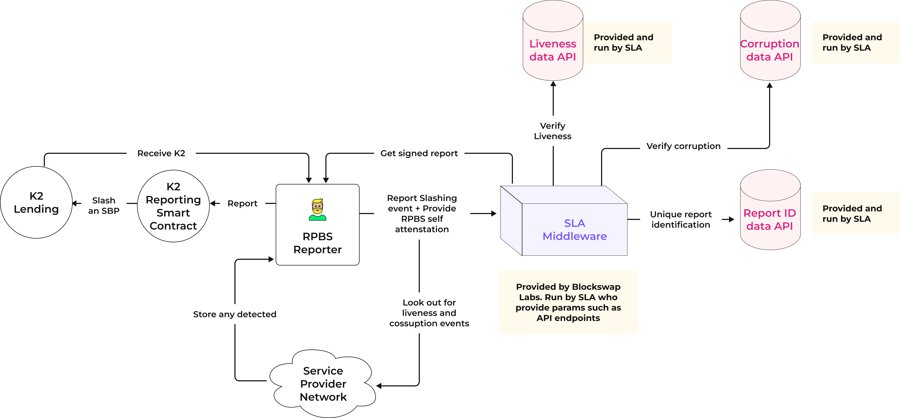
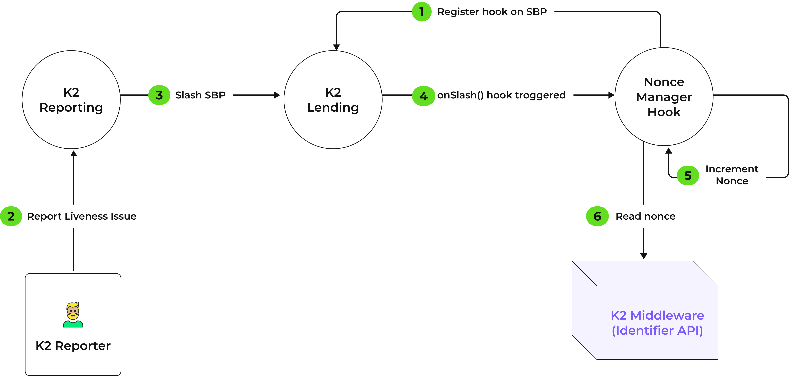

# K2 Middleware

[K2 middleware](https://github.com/restaking-cloud/K2-middleware) is a simple software hosted by a Service Provider that 
can verify liveness and corruption issues in a service provider network flagged by [K2 Reporters](https://github.com/restaking-cloud/K2-reporter).
The middleware is fully compatible with the K2 protocol smart contracts and dramatically reduces the amount of software
and services that a service provider needs to build in order to spin up a re-staking network that re-uses the economic 
security of Ethereum. 

More info on the K2 protocol can be found [here](https://restaking.cloud).

Slashable borrow positions (SBPs) need to be opened on chain either via the [K2 dapp](https://restaking.cloud) 
or [K2 SDK](https://github.com/restaking-cloud/K2-sdk) in order to activate the middleware. 

K2 middleware software can be appointed for
one or more SBPs. When creating the SBP, the ECDSA public key of the middleware simply needs to be presented and is referred
to as the `designated verifier` for any slashing. It therefore doesn't matter how many middleware instances are running for an SBP because only a known entity identified by an ECDSA can represent an SBP in the verification of a network fault (liveness or corruption) which would lead to the slashing of earnings for restaked economic security.

# Architecture 


In the above architecture diagram, we find the intersection of two worlds: the K2 reporter and the K2 middleware. 

The inner workings of the middleware are abstracted away from the reporter but the reporter relies on the middleware to perform its duties mainly in 2 ways:
- Reconnaissance (gathering current network configuration and state)
- Attestation of detected violation (reporting faults and getting paid in ETH)

The core middleware architecture aims to be: 
- Lean
- Application agnostic
- Modular
- Customizable

All whilst being compatible with the K2 protocol. 

Developers working with Service Providers to use this middleware to power their restaking applications only need to concern themselves with the customizability part meaning, for example, they can focus on what rules are important to inject into their custom slashing logic. Customizable slashing logic will be a big focus on this and other documentation. 

## Middleware Micro-services
Before going further, we need to address the important microservices behind the middleware that enables the custom slashing logic. Note, the middleware is designed to work out of the box without any adjustments. However, the following components (given as templates in folders that are pre-pended with `example-`) are expected to take on their own logic specific to the restaking application. These components are:
- Liveness API
- Corruption API
- Corruption Verification API
- Identifier API

The liveness API should be able to fetch liveness information at a given consensus layer slot. Liveness depends on your application. For example:
- For PoN (https://pon.network), liveness is defined as a proposer being online and ready to sign a block header for the highest bid. If the proposer requests a header and does not sign, this is a liveness fault that is recorded inside the PoN network at that slot and can be queried historically and flagged as a liveness issue from a PoN relayer
- ZK validator software could define liveness issues as a validator that does not validate proofs sent to it
- etc.

The corruption API works the same but processes corruption events. For example: 
- In PoN, a missed slot or invalid payment deviating from the credible commitment is a protocol violation and this corruption commands a higher penalty. 

Identifier API is interesting. On chain and off chain approaches can be taken here but what you want to ensure here is that you correctly tag and identify events. 
Hundreds of reporters may spot the same liveness issue at slot 10 but that event should be reportable once to the K2 contracts. Therefore, many reporters may have an attestation from the middleware but the unique identification of the event ensures the event is not reported more than once and therefore excessive slashing is avoided for the SBP.

Note: nonces are a uint256 value from a K2 contract perspective.

A simple implementation of the identifier API if just using an off chain approach could be just to simply use the slot number as the identifier.
For example, lets suppose your re-staking application simply defines liveness as whether validators are running your software or not.
Therefore, your re-staking network would have some understanding of how many validators are globally online and running the software versus offline at a given slot.

For example, your liveness data may look like this at slot `5`:
```javascript
{
    numOfValidatorsOnline: '8',
    numOfValidatorsOffline: '2',
    totalValidators: '10'
}
```

Using, slot `5` as a nonce, many reporters could curate the same liveness fault report but only one report will be accepted by the smart contract
since once a nonce (for a given service provider) is consumed by the K2 smart contracts, it will not be accepted again.

Therefore, if you imagine more complex definition of liveness events or more than one liveness events, you will need to generate 
appropriate nonces.

It is possible to generate and use nonces on-chain to avoid having to build complex systems to generate them off chain.
In order to do this one needs to take advantage of a K2 contract feature for SBP positions: hooks. Hooks allow an SBP
position to define a hook that will receive notifications after certain events have taken place related to an SBP. One
of those events could be for example `slashing` where notification of a slashing could cause a nonce to be incremented
as per the following diagram:



## Bearer authentication

Microservices such as the identifier API use HTTP bearer authentication due to the sensitivity of some of these services.
For example, the identifier API could be generating nonces on the fly and accidentally exposing this to the outside
world could lead to some DoS attacks. To counter this, bearer authentication is used to authenticate the middleware
to the identifier API.

To ensure this is configured correctly, simply use the same bearer token in the `env/` of the middleware and the `env/`
of the individual service.

# Getting started

K2 Middleware is a `serverless` project that aims to make spinning up the software locally or hosting on AWS as simple
and as straightforward as possible even going as far as to provide Github actions that instantiate the lambdas. The
provided Dockerfile(s) help serverless but also allow a non-serverless approach to be taken by using simpler docker
containers.

The root of the repository contains the core middleware logic. All the example microservices (in directories pre-pended
with `example-`) and the core middleware can be spun up in the same way following the steps below.

## Installing dependencies

Yarn is the package manager of choice and the dependencies can be installed with the following command:
```
yarn
```

## Updating the environment variables

Depending on the network you are deploying the software, you can update the appropriate environment file. For example,
if running locally, you can update the `config.local.json` file. 

## Running locally

You can run the software locally by simply executing the command:
```
yarn serve
```

Which will spin up an offline lambda for you to interact with. The CLI logs will inform you what ports to interact with.

## Deploying automatically with Github actions

The `.github` folder contains the actions that will use `serverless` to deploy to AWS.

# Injecting your own slashing logic

The liveness and corruption microservices are where the custom logic for your re-staking applications are injected.

Having these microservices detached from the core middleware means that the middleware can focus on K2 protocol compatibility
and reporting whilst re-staking applications can write their own slashing logic in a plug and play fashion. Given the nature
of the microservice architecture, liveness and corruption services can be written in any language and use any framework
which can be advantageous in some scenarios. For example, some applications may find better tooling in Typescript / Javascript where
as other tooling may only be available or would be better performant in go lang.

It is really up to the re-staking application to decide. Out of the box templates are given to get started and to use
as a guide for the request / response specification required to be compatible with the core middleware service. 

